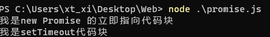

Promise就是一个对象,用于传递异步操作的消息.

Promise 是一个对象，也是一个构造函数

特点:

- Promise 实例有三种状态操作 Pending、Resolved(Fulfilled),Rejected
- 一旦改变,就不会再变,状态的改变只有可能是从 Pending 变为 Resolved 和从 Pending 变为 Rejected 能将异步操作以同步流程表达出来,避免出现callback hell
- 让回调函数变成了规范的链式写法，程序流程可以看得很清楚


缺点:

- 无法取消Promise,一旦新建就会立即执行的同步任务.  
- 如果不设置callback,内部throw err
- 处于Pending状态时候,无法得知目前进展到那个阶段

示例

```js
setTimeout(() => {
    console.log("我是setTimeout代码块");
})
const p1 = new Promise((resolve, reject) => {
    console.log("我是new Promise 的立即指向代码块");
})

```



示例2

```js
setTimeout(() => {
    console.log("我是setTimeout代码块");
})
const p1 = new Promise((resolve, reject) => {
    console.log("我是new Promise 的立即指向代码块");
    setTimeout(() => {
        console.log('异步指向任务完成!获得了一些结果')
        resolve("成功了!");
    },1000)
})
p1.then((res) => {
     console.log(res);
     }
)
```


# Promise.prototype.then()


Promise 实例具有 then 方法,即 then 方法是定义在原型对象 Promise.prototype 上的.

作用是为 Promise 实例添加状态改变时的回调函数

then 方法可以接受两个回调函数作为参数,第二个参数就是可以选的.

then方法返回的是一个新的Promise实例(不是原来的那个Promise).因此可以采用链式写法,即then方法后面调用另一个then方法.采用链式的then,可以指定一组按照次序调用的回调函数,后面的回调函数,需等待该Promise对象状态的改变,才会被调用


# **Promise.prototype.cath()**

一般来说,不要在then定义Reject状态的回调函数,即then的第二个参数,总是使用catch方法

Promise.prototype.cath方法是.then(null,rejection)的别名

当异步操作throw err时,状态会飙车Rejected的,就会调用catch方法处理错误

Promise对象的错误具有"冒泡"性质,错误会被一直向后传递,直到下一个catch捕获,被捕获后不会传递到外层,不会有任何反应