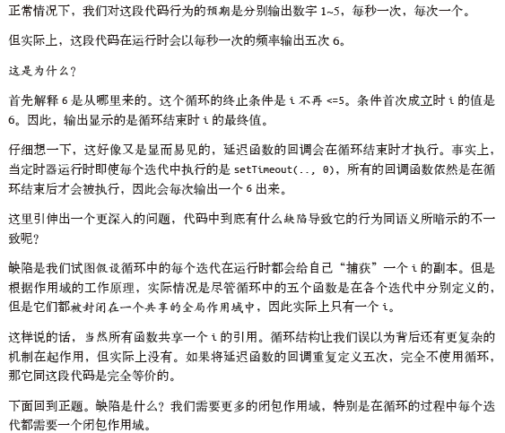

定义:

当一个函数被定义在其他函数中,一个内部函数处理可以访问自己的参数和变量,也可以访问把它嵌套在其中的父函数的参数和变量,通过函数字面量创建的函数对象包含一个链接到外部上下文的连接,这被称为闭包.<p align="right"> JavaScript语言精粹修订版</p>


闭包的产生:

> ***当函数可以记住并访问所在的词法作用域,即使函数是在当前的词法作用域之外执行,这时就产生了闭包.***
>
> 本质上无论何时何地,如果将函数(访问他们各自的词法作用域)当作第一级的值类型并导出传递,就能看到闭包在这些函数的应用.定时器、事件监听器、Ajax请求,跨窗口通信,web work或其他任何的异步或者同步任务中,***凡是使用了回调函数,实际上就是在使用闭包***							<p align="right">你不知知道的JavaScript上卷</p>

IIFE(立即调用函数表达式)并不是观察闭包最好的例子,但是的确创建了闭包,并且也是最常用来创建可以被封闭的闭包工具.

从技术上来讲,闭包是发生在定义时.

一个经典面试题

```js
for ( var i=1; i<=5; i++) {
	setTimeout( function timer() {
		console.log( i );
	}, i*1000 );
}
```

能否解释下会打印什么?为什么?我们后面给出


首先因为 `setTimeout` 是个异步函数，所有会先把循环全部执行完毕，这时候 `i` 就是 6 了，所以会输出一堆 6。

解决办法两种，第一种使用闭包

```js
for (var i = 1; i <= 5; i++) {
  (function(j) {
    setTimeout(function timer() {
      console.log(j);
    }, j * 1000);
  })(i);
}
//1~5
```

第二种就是使用 `setTimeout` 的第三个参数

```
for ( var i=1; i<=5; i++) {
	setTimeout( function timer(j) {
		console.log( j );
	}, i*1000, i);
}
//1~5
```

第三种就是使用 `let` 定义 `i` 了

```js
for ( let i=1; i<=5; i++) {
	setTimeout( function timer() {
		console.log( i );
	}, i*1000 );
}
//1~5
```


